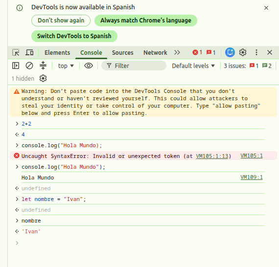
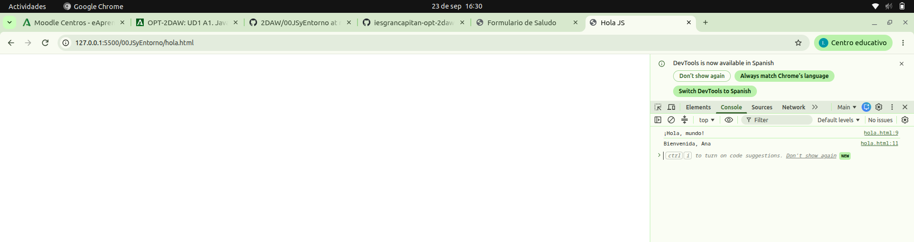
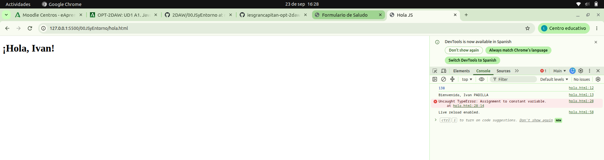
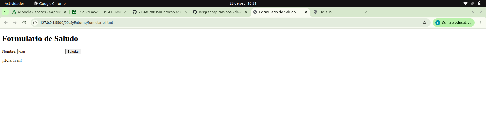

Parte 1: Instalación y configuración
    I.nstala Visual Studio Code
    Descarga e instala VS Code desde code.visualstudio.com

Parte 2: Primeros pasos con la consola del navegador
    Abre tu navegador web (Chrome, Firefox, Edge, etc.).
    Accede a cualquier página web y pulsa F12 o Ctrl+Shift+I para abrir las herramientas de desarrollo.
    Haz clic en la pestaña "Consola".
    Prueba los siguientes comandos uno por uno y observa el resultado:
    2 + 2
    console.log("¡Hola, mundo!")
    let nombre = "Anita"
    nombre

    

Parte 3: Tu primer archivo HTML + JavaScript
    Crea una carpeta llamada 00JSyEntorno dentro de tu espacio de trabajo.
    Dentro de esa carpeta, crea un archivo llamado hola.html.
    Escribe el siguiente código en hola.html:
    <!DOCTYPE html>
    <html lang="es">
    <head>
    <meta charset="UTF-8">
    <title>Hola JS</title>
    </head>
    <body>
    
    </body>
    </html>
    Desde VSCode abre el archivo hola.html en tu navegador.
    Observa el resultado en la consola del navegador.
    

Parte 4: Experimenta
    Cambia el valor de la variable nombre por el tuyo y recarga la página.
    Añade una línea que sume dos números y muestre el resultado con console.log.
    Añade otra variable con tu apellido y muestra un saludo completo.
    Modifica el saludo para que incluya el apellido en mayúsculas. Busca en la consola cómo convertir una cadena a mayúsculas. Para ello usa un literal de cadena (con tu nombre) seguido del operador punto (.)
    Modifica el archivo para que el saludo se muestre en la página web en lugar de la consola. Usa document.body.innerHTML para esto:
    document.body.innerHTML = "<h1>¡Hola, " + nombre + "!</h1>";
    Publica tu proyecto en el repositorio de GitHub y usa GitHub Pages para alojarlo. Sigue esta guía para hacerlo.
    

parte 5: formulario HTML + JavaScript
    Crea un archivo llamado formulario.html en la misma carpeta 00JSyEntorno.
    Crea un archivo llamado formulario.js en la misma carpeta 00JSyEntorno.
    Escribe el siguiente código en formulario.html:
    /*<!DOCTYPE html>
    <html lang="es">
    <head>
    <meta charset="UTF-8">
    <title>Formulario de Saludo</title>
    </head>
    <body>
    <h1>Formulario de Saludo</h1>
    <form id="formulario">
        <label for="nombreInput">Nombre:</label>
        <input type="text" id="nombreInput" required>
        <button type="submit">Saludar</button>
    </form>
    

    
    
    </body>
    </html>
    Escribe el siguiente código en formulario.js:
    document.addEventListener('DOMContentLoaded', function() {
    document.getElementById('formulario').addEventListener('submit', function(event) {
        event.preventDefault();
        const nombre = document.getElementById('nombreInput').value;
        document.getElementById('salida').textContent = '¡Hola, ' + nombre + '!';
    });
    });*/
    Desde VSCode abre formulario.html en tu navegador y prueba el formulario.
    

Parte 6: Preguntas de reflexión
¿Qué hace console.log?
- Mostrar en consola lo que le pasemos

¿Qué ocurre si cambias el valor de la variable desde la consola? ¿Se puede?
- Depende: si la variable se declaró con let, sí se puede reasignar su valor desde la consola. Si se declaró con const, no se puede reasignar, y como en este caso es un valor primitivo, tampoco existe otra forma de cambiarlo.

¿Para qué sirve la consola del navegador en este contexto?
- Para hacer pruebas con el codigo sin cambiar el original

Para qué sirve el archivo HTML en este contexto?
- Para tener un esqueleto de la pagina, quiero decir, para poder ver los cambios que hace JavaScript en la web.

¿Por qué es una buena práctica separar el código JavaScript del HTML?
- Por si algun dia hay que actualizar o cambiar el codigo solo tienes que tocar el archivo .js y no los demas.

Por qué se llama Vanilla JavaScript?
- Para referirse a el JavaScript mas antiguo, sin librerias ni frameworks ni nada.

Cuándo se usa JavaScript puro y cuándo se usan frameworks o librerías como REACT?
- Usas frameworks o librerias cuando vas a desarrollar una web grande y compleja para que los frameworks y librerias te ayuden a hacerla y mantenerla mas facil

Cómo se define una función en JS
- function nombre(atributo1, atributi2){}

Sobre el código demuestra la diferencia entre let y const
Indica en el código:
- fichero hola.html linea de la 17 a la 28

Si puede evitarse el uso de let. Qué hace
- JavaScript va a crearte una variable global sin que de error.

Cuántos eventos hay en el código, cuáles son y para qué sirven
- HAy dos eventos:
    - 1º DOMContentLoaded: Se dispara cuando el navegador termine de cargar todo el HTML. Sirve para asegurarse de que JavaScript no intenta acceder a elementos del HTML hasta que no esten cargados en la paginas.

    - 2º Submit: Se dispara cuando el usuario envia el formulario. Sirve para capturar ese momento y ejecutar si logica, osea, lee el valor del input y muestra el saludo.